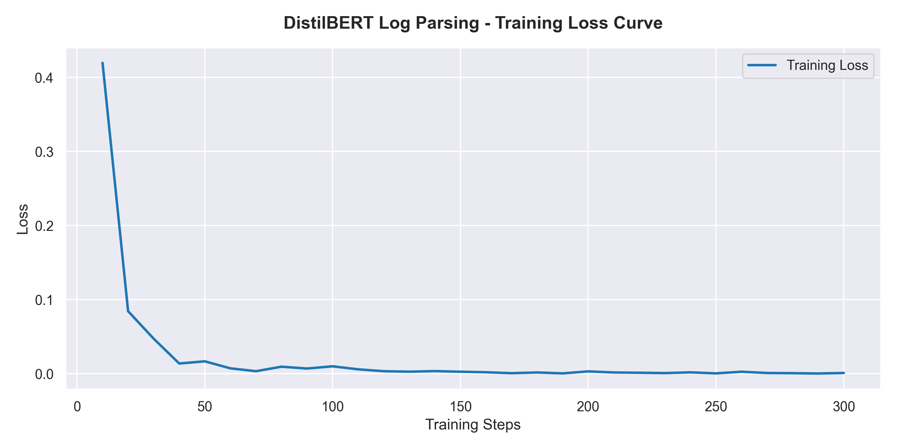
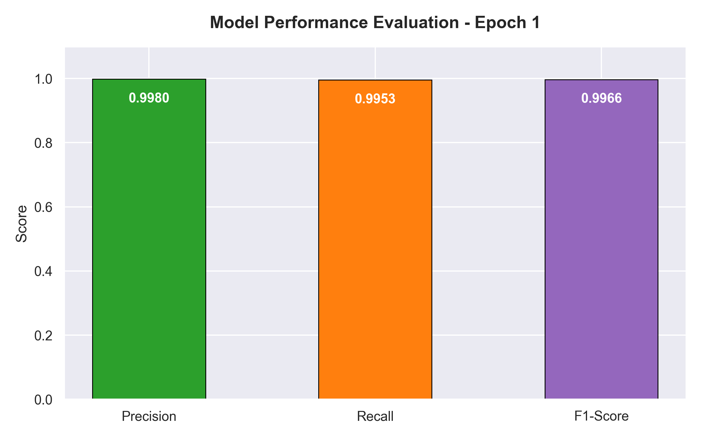

# Automated Infrastructure Log Parsing via Token Classification (DistilBERT)
An advanced deep learning framework that transforms unstructured cloud-native infrastructure log parsing into a sequential Named Entity Recognition (NER) task using contextual bi-directional embeddings.
## Abstract & Problem Statement
In contemporary DevOps and high-availability cloud-native ecosystems, unstructured system logs serve as the primary source of truth for runtime observability, root-cause analysis, and anomaly detection. Traditional log parsing strategies rely heavily on hardcoded regular expressions (Regex), static rule engines, or structural heuristic algorithms (e.g., Drain, LenMa). While computationally lightweight, these approaches fail critically under scalability constraints due to:

Brittleness and Maintenance Overhead: Even minor microservice format mutations require tedious updates to structural rules, leading to maintenance debt.

Lack of Semantic Context: Traditional tokenization strips out positional semantic value, rendering algorithms incapable of differentiating between lexical syntax similarities that carry completely distinct runtime meanings.

This project addresses these limits by casting log parser operations as a downstream Token Classification (NER) problem. By training a localized DistilBERT architecture, the framework dynamically discriminates between invariant structural system text (Log Templates) and highly dynamic operational arguments (Parameters like IPs, URIs, and Process IDs) without relying on rigid pattern configurations.
## Architecture & Methodology
The core architecture operates as a data pipeline divided into sequence token alignment, transformer backbone feature extraction, and variable token aggregation.
```text
[Raw Infrastructure Log] ──> [Timestamp Isolation Engine] ──> [DistilBERT WordPiece Tokenizer]

[Dynamic Templates] <── [Parameter Masking (<*>)] <── [Argmax Classification] <── [Fine-Tuned Head]
```
### 1. Data Processing & Target Alignment
Raw logs from the open-source Loghub Linux dataset are processed alongside their structured templates. Words mapping directly to parameter positions (<*>) are systematically tagged as 1 (Parameter), while static invariant components are labeled as 0 (Standard Text).
### 2. Subtoken Handling & Loss Function Protection
Because the underlying architecture uses WordPiece subtokenization, a single complex string entity (e.g., an IP address like 192.168.1.5) is split into multiple sub-tokens: ["192", ".", "168", ".", "1", ".", "5"]. This introduces a sequence length discrepancy against word-level labels.To resolve this alignment issue:The first subtoken of a parameter word inherits the primary classification index (1).All subsequent trailing sub-tokens, as well as structural padding and special tokens (like [CLS] and [SEP]), are assigned a hard label of -100.PyTorch's cross-entropy loss function is configured to explicitly ignore -100 indices, successfully preventing gradient skewing caused by sub-token fractioning.
### 3. Bidirectional Contextual Representation
Unlike older sequential networks (LSTMs) or left-to-right language models, the distilbert-base-uncased backbone leverages multi-head self-attention mechanisms. This allows it to evaluate the complete spatial context of a log line bidirectionally. The network doesn't just evaluate a token on its own; it learns that text patterns surrounding a string (e.g., "connection refused to") signal that the subsequent sequence is highly likely to be a dynamic network parameter.
## Training Environment
The training execution pipeline was optimized for resource-constrained local infrastructure using the following technical stack:Deep Learning Framework: PyTorch Core (torch>=2.0.0)Hardware Acceleration Engine: Apple Silicon Local Metal Performance Shaders (MPS Execution Context on mps:0)Orchestration API: Hugging Face native Trainer ecosystem decoupled with accelerate for distributed memory abstraction and tensor streaming.Optimization Arguments:Base Architecture: 6-layer, 768-hidden, 12-heads transformer (distilbert-base-uncased)Initial Learning Rate: $2 \times 10^{-5}$Batch Size Strategy: 16 sequences per device stepTotal Training Epochs: 3Weight Decay Coefficient: 0.01 ($L_2$ regularization)
## Results & Convergence Evaluation
The fine-tuned model achieved near-optimal classification performance on the evaluation dataset split. The evaluation metrics computed via the seqeval sequence validation layer yielded highly accurate results:
* Evaluation Accuracy: 99.64%
* Evaluation Precision: 99.86%
* Evaluation Recall: 99.32%
* Final F1-Score: 0.9959 (0.9966 achieved at Peak Checkpoint)
## Convergence Visualizations
The training logs extracted from the internal JSON state reflect a clean error reduction curve and structural precision metrics:
#### Training Loss Minimization Curve


#### Performance Metrics Summary (Epoch 1)


## How to Run
Follow these instructions to spin up the environment, process the Loghub assets, execute the training pipeline, and run production inferences.

### 1. Prerequisites & Virtual Environment Initialization
Ensure your host terminal runs natively inside an ARM64 or x86_64 target space using Python 3.11 or 3.12.
```yaml
# Clone the repository
git clone <repository-url>
cd ADA447_Project_Log_Segmentation

# Initialize the virtual sandbox environment
python3 -m venv venv
source venv/bin/activate
```
### 2. Dependency Installation
```yaml
pip install --upgrade pip setuptools wheel
pip install -r requirements.txt
```
### 3. Execute the Preprocessing Engine
```yaml
python src/dataset_processor.py
```
### 4. Execute the Fine-Tuning Optimization Loop
```yaml
python src/train.py
```
### 5. Generating Evaluation Plots
```yaml
python src/visualize_reports.py
```
### 6. Production Inference & Template Extraction
```yaml
python src/inference.py
```
